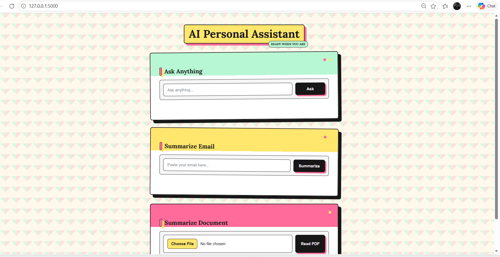

# AI Personal Assistant

A smart **AI Personal Assistant** built using **Python (Flask)** and **Google Gemini API** that can interact with users, answer questions, summarize emails, and summarize PDF documents — all from a clean web interface.

---
**Repository:** [yaduwanshidiya9-png/AI-Personal-Assistant](https://github.com/yaduwanshidiya9-png/AI-Personal-Assistant)

---

## Preview



---

## Features

-  **Ask Anything** — Chat with an AI assistant powered by Google Gemini and get helpful, conversational answers.
-  **Email Summarizer** — Paste any long email and get a concise 2–3 sentence summary capturing key points, decisions, and action items.
-  **Document Summarizer** — Upload a PDF document and receive a clear, bullet-point summary of its contents.
-  **Web Interface** — Simple, responsive UI built with HTML, CSS, and JavaScript.
-  **Secure API key handling** using `.env` environment variables.

---

## Tech Stack

| Layer | Technology |
|-------|-------------|
| Backend | Python, Flask |
| AI Model | Google Gemini (`gemini-3-flash-preview`) via `google-genai` SDK |
| Frontend | HTML, CSS, JavaScript |
| Deployment | Gunicorn (production-ready WSGI server) |
| Config | python-dotenv |

---

## Project Structure

```
AI-Personal-Assistant/
├── static/
│   └── style.css         # CSS 
├── templates/
│   └── index.html       # Main UI
├── main.py              # Flask app & API routes
├── requirements.txt     # Python dependencies
├── .gitignore
└── README.md
```

---

## Getting Started

### 1. Clone the repository

```bash
git clone https://github.com/yaduwanshidiya9-png/AI-Personal-Assistant.git
cd AI-Personal-Assistant
```

### 2. Create a virtual environment (recommended)

```bash
python -m venv venv
# Windows
venv\Scripts\activate
# macOS / Linux
source venv/bin/activate
```

### 3. Install dependencies

```bash
pip install -r requirements.txt
```

### 4. Set up your Gemini API key

Create a `.env` file in the project root and add:

```env
GEMINI_API_KEY=your_google_gemini_api_key_here
```

> Get your free API key from [Google AI Studio](https://aistudio.google.com/app/apikey).

### 5. Run the app

```bash
python main.py
```

Then open your browser and visit **http://127.0.0.1:5000** 🎉

---

## API Endpoints

| Method | Endpoint | Description |
|--------|----------|-------------|
| `GET`  | `/` | Renders the main web interface |
| `POST` | `/ask` | Send a question (`question` field) and get an AI-generated answer |
| `POST` | `/summarize` | Send email text (`email` field) and get a short summary |
| `POST` | `/summarize-document` | Upload a PDF (`document` file) and get a bullet-point summary |

Max upload size: **20 MB**

---

## How It Works

The app uses Google's **Gemini** model through the official `google-genai` SDK:

- **Chat** — Sends the user's question with a personal-assistant system prompt.
- **Email Summary** — Uses a low-temperature prompt for accurate, concise summaries.
- **Document Summary** — Sends the raw PDF bytes to Gemini's multimodal input for direct understanding.

---

## Dependencies

```
Flask
google-genai
gunicorn
python-dotenv
```

---

## Deployment

For production deployment (e.g., on Render, Railway, or Heroku), use **Gunicorn**:

```bash
gunicorn main:app
```

Make sure to set the `GEMINI_API_KEY` environment variable in your hosting platform's settings.

---

## Contributing

Contributions, issues, and feature requests are welcome! Feel free to open an issue or submit a pull request.

---

**Diya Yaduwanshi**
🔗 [GitHub: @yaduwanshidiya9-png](https://github.com/yaduwanshidiya9-png)

---

⭐ If you like this project, don't forget to **star the repo**!